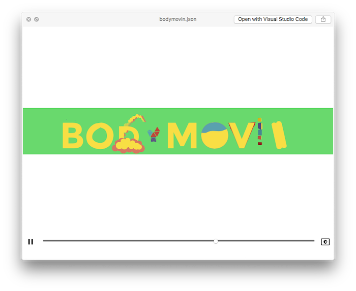

# QuickLook Bodymovin

This is an open-source QuickLook plugin to generate previews for [Adobe After Effects](http://www.adobe.com/products/aftereffects.html) animations exported as json with [Bodymovin](https://github.com/bodymovin/bodymovin).

 
Installation
------------
Requires Mac OS X 10.10 or later (but tested on 10.12).

* Download the current version of the plugin from the "[Releases]" section
* Unzip it, and put the `Bodymovin.qlgenerator` into `~/Library/QuickLook` (Create the folder, if it does not exist)
* You may need to reboot to enable it or run `qlmanage -r` in your Terminal app (found in Applications → Utilities).

Using the plugin
----------------
* You should be able to preview your Bodymovin `.json` files using the space key in Finder.

Uninstall
---------
* Run the Terminal app (found in Applications → Utilities).
* Copy the following and paste into the Terminal app:

        sudo rm -rf "~/Library/QuickLook/Bodymovin.qlgenerator"

* Press Enter.
